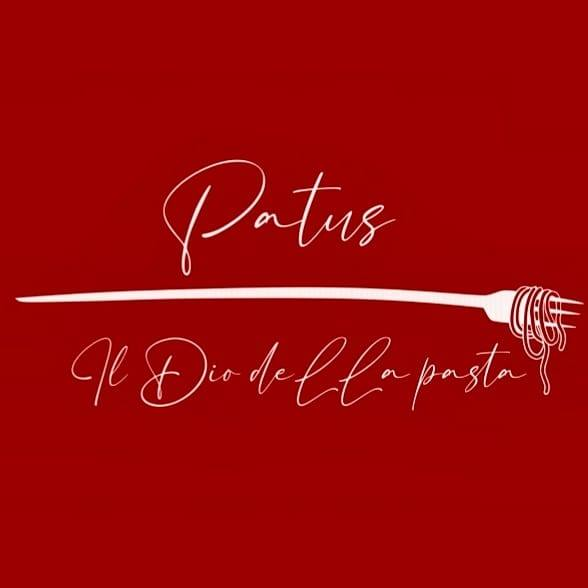
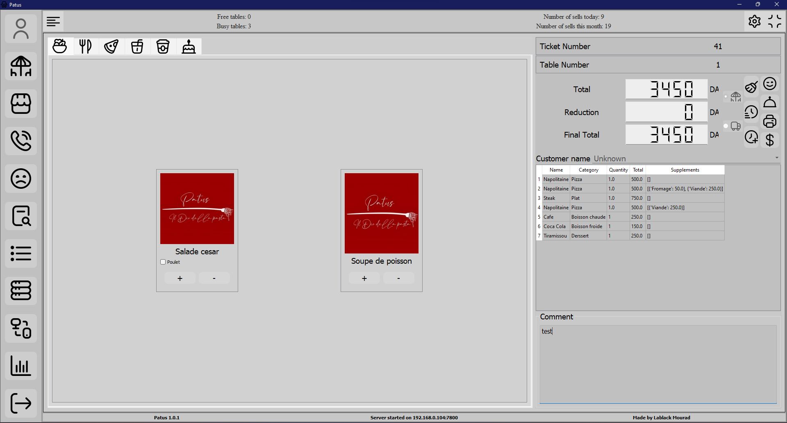
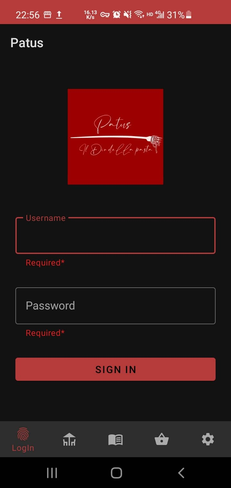
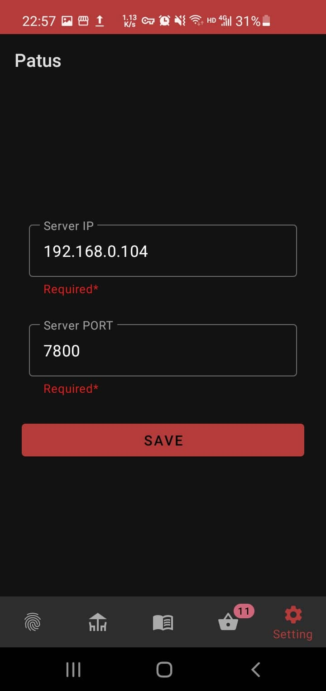
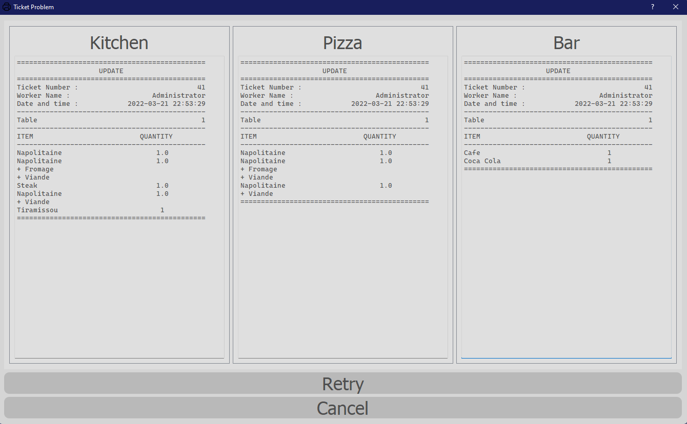

# Patus PC application


This is the application for the restaurant Patus.



## Progress

- [x] Create the interface
  - [x] Full screen
  - [x] Side bar
  - [x] Database interactions
  - [x] Tables viewer
  - [x] Cash register
  - [x] Setting
- [x] Bind the interface
- [x] Create the database logic
- [x] Create the server thread
- [x] Create the clock thread
- [x] Create the receipt printer

## How to download

Make sure you have git installed, please refer to [how to install git](https://github.com/git-guides/install-git).

Then run the command below to clone the repository, refer to [how to use git clone](https://github.com/git-guides/git-clone) for more information.

```git
git clone https://github.com/Mouradost/PatusNewShop.git
```

run the command bellow to update your application, check [git pull](https://github.com/git-guides/git-pull) for more information.

```git
git pull origin/master
```

## How to use

- Clone the repository in your local machine
- Run [PatusUi.py](PatusUi.py) by the command bellow

  ```cmd
  python PatusUi.py
  ```

- Install the [PatusMobileApp.apk](MobileAPP/PatusMobileApp.apk) on your phone
- Run and login to the Mobile APP
- Change and save your setting by following the pictures bellow
- Congratulation! You can use the app now





## Ticket printing



## Issues

If you have any issues or requests please click [here](https://github.com/Mouradost/PatusNewShop/issues/new/choose) and choose the right template for your request, your request will be handled as soon as possible.
